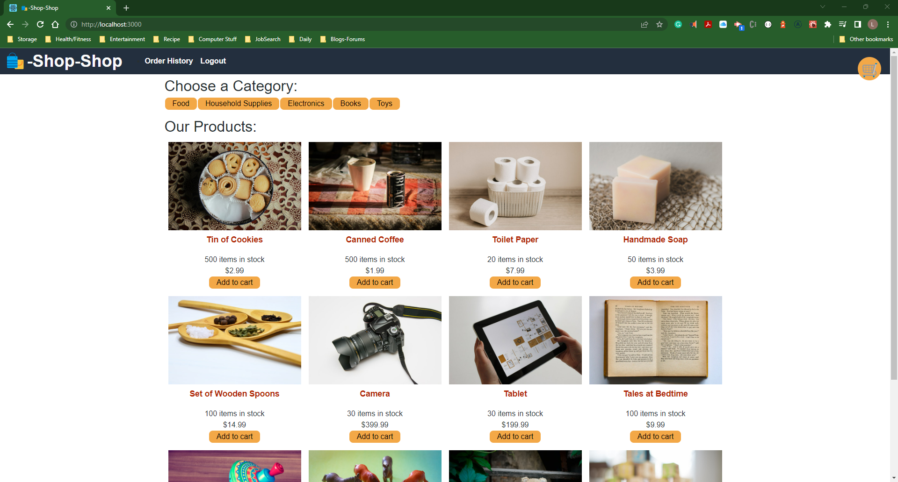

# <center><font color="blue">**MOD22-C-EStore**</font></center>
E-commerce platform using the MERN stack (refactoring using to use Redux)

[](https://opensource.org/licenses/MIT)


<a target="_blank" href="https://github.com/LRiccardo" rel="nofollow"></a> 
<a target="_blank" href="https://www.linkedin.com/in/lRicciardo/" rel="nofollow"></a>
 

## <center><font color="blue">**Description**</font></center>

Refactor e-commerce platform to use Redux for global state management.

[<center><font color="yellow"> > Heroku Deployed App Link < </font></center>](https://img.shields.io/badge/License-MIT-yellow.svg)

[<center><font color="yellow"> > GitHub Repo Link < </font></center>](https://github.com/LRicciardo/MOD22-C-EStore)

## Table of Contents
  
- [User Story](#userstory)
- [Acceptance Criteria](#acceptance-criteria)
- [Visual Documentation](#visual-documentation)
- [Installation](#installation)
- [Usage](#usage)
- [Credits](#credits)
- [License](#license)
- [Feature](#features)
- [How to Contribute](#contribute)
- [How to Test](#test)
- [Contact Info](#contact) 

## User Story

```md
AS a senior engineer working on an e-commerce platform
I WANT my platform to use Redux to manage global state instead of the Context API
SO THAT my website's state management is taken out of the React ecosystem
```

## Acceptance Criteria

```md
GIVEN an e-commerce platform that uses Redux to manage global state
WHEN I review the app’s store
THEN I find that the app uses a Redux store instead of the Context API
WHEN I review the way the React front end accesses the store
THEN I find that the app uses a Redux provider
WHEN I review the way the app determines changes to its global state
THEN I find that the app passes reducers to a Redux store instead of using the Context API
WHEN I review the way the app extracts state data from the store
THEN I find that the app uses Redux instead of the Context API
WHEN I review the way the app dispatches actions
THEN I find that the app uses Redux instead of the Context API
```

## Visual Documentation

The following video shows the application being used from Insomnia app:

DEMO video 1: The E-Commerce store.

[](https://drive.google.com/file/d/132FF9qvVWTum2H9SD3ta7WRZCZIWxEQQ/view?usp=share_link)

***

## Installation


Initialize npm to produce the package.json file.
Type npm install to install the following: MongoDB, mongoose, express, dotenv, luxon.
 
In the command line, type npm start.
USES Insomnia to perform CRUD tasks


## Usage
- JavaScript with Node.js - base coding language
- express - to create the routers/endpoints
- dotenv - to hide the environmental variables (password/database)
- MongoDB package - as the database dialect
- mongoose - to interpret the database commands
- Insomnia app - to perform the CRUD functions to the database 

## Credits

I would like to thank my tutoring for helping me. (Though seeding gave me lots of trouble and I only seeded Users successfully. I want to look into npm mongo-seeding more.)

## License

This application is using the The MIT License License. Click on the badge  [](https://opensource.org/licenses/MIT)  to follow the link to the license.

---

## Features


## How to Contribute

This application follows the [Contributor Covenant](https://www.contributor-covenant.org/).

If you would like to contribute it, you can create an issue on GitHub repository at https://github.com/LRicciardo/MOD18-C-Social-Network-API. 

## Tests


  
## Contact Info

This application follows the [Contributor Covenant](https://www.contributor-covenant.org/).

If you would like to contact me about an issue, you can send an email to Liane.Ricciardo@gmail.com.
